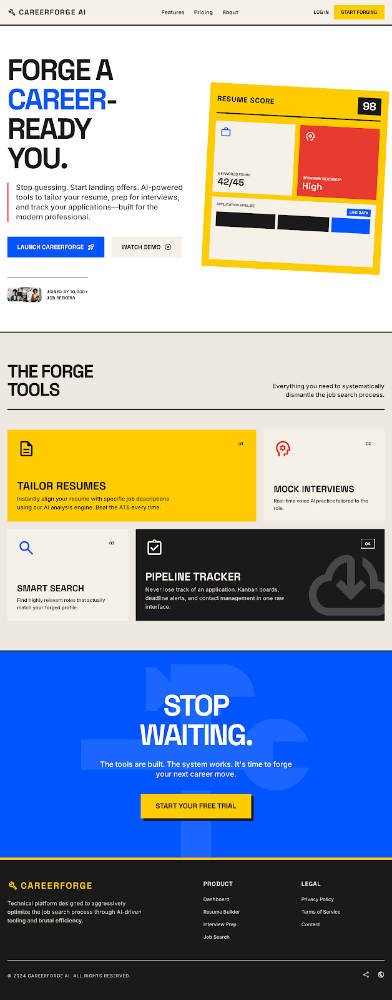
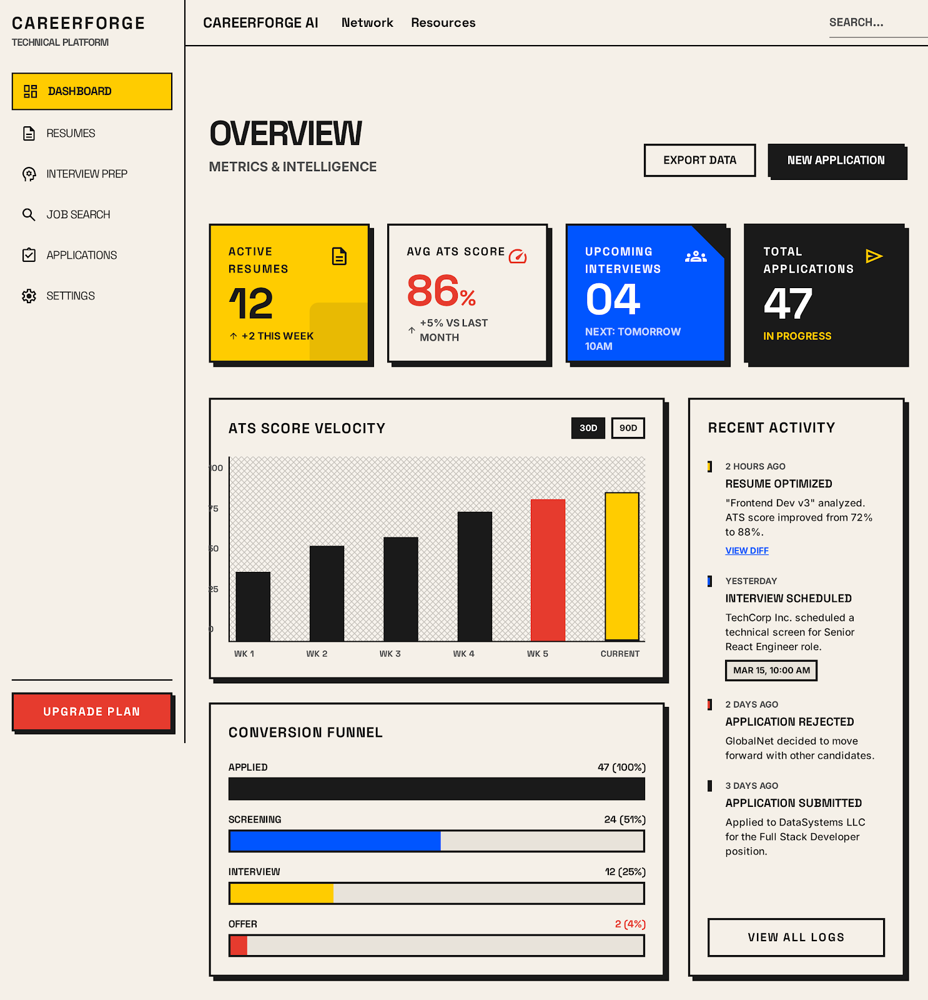
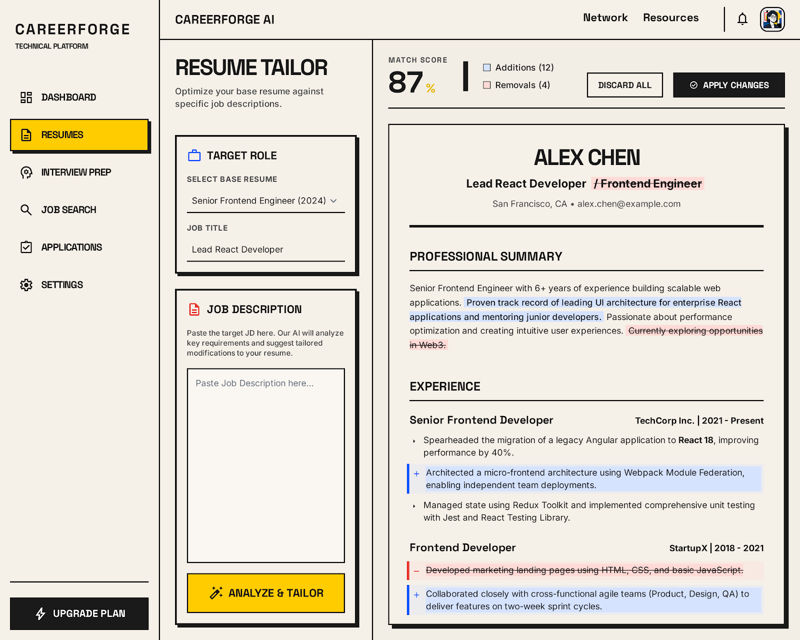
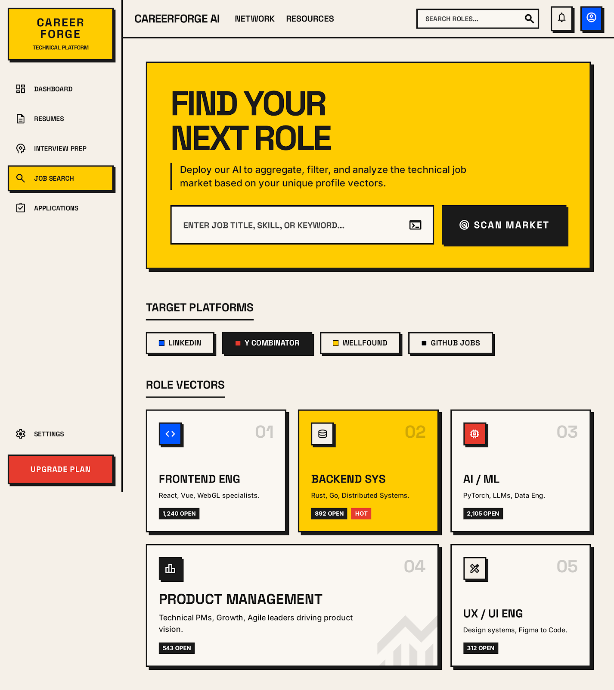
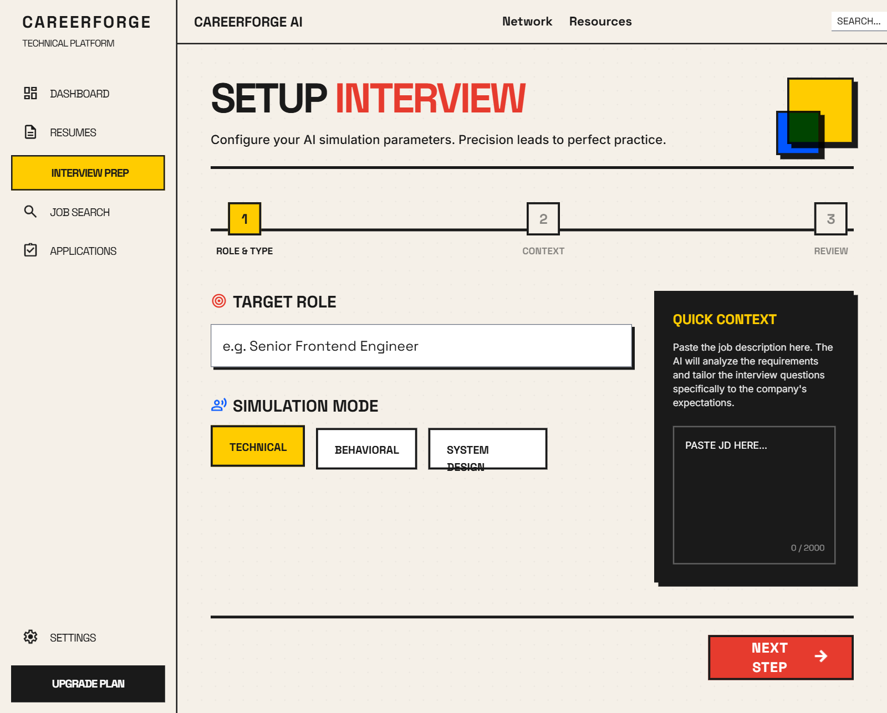
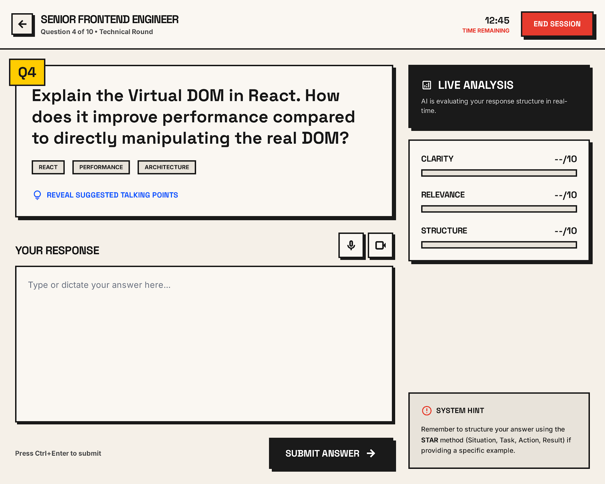
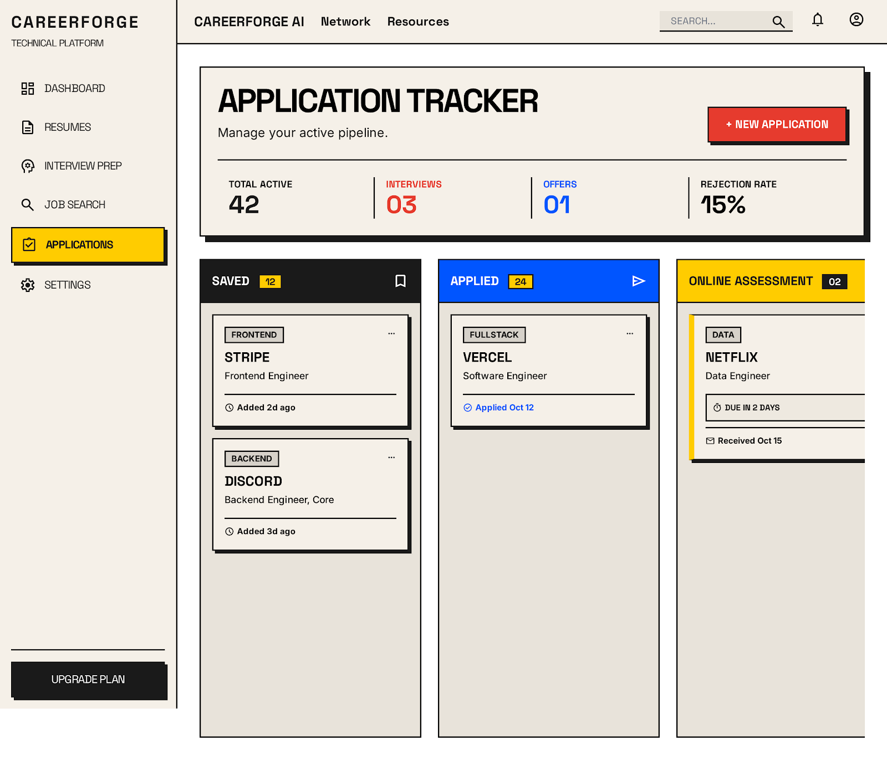
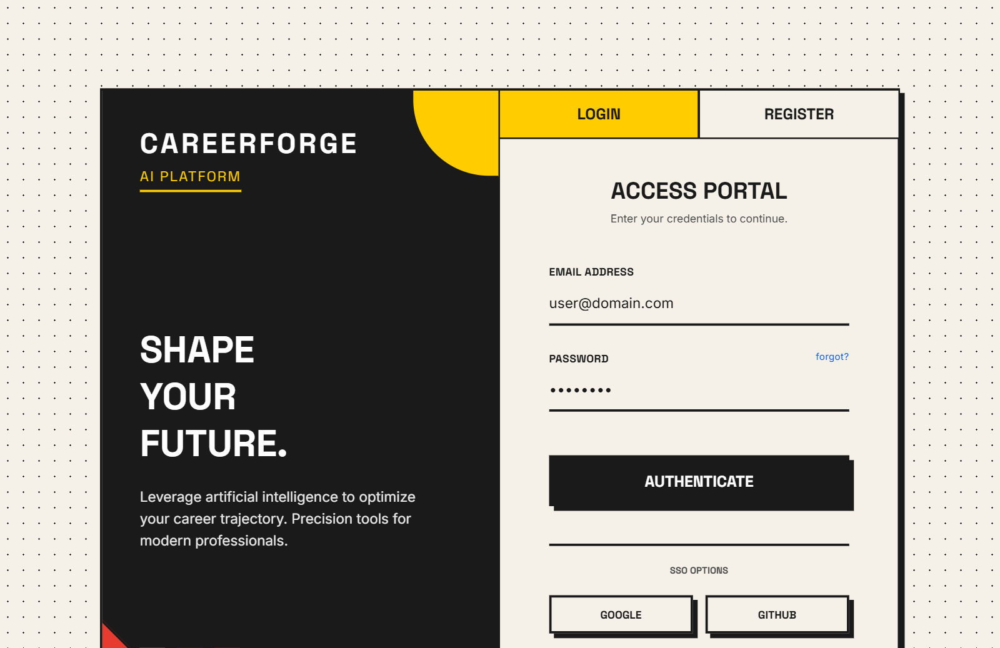
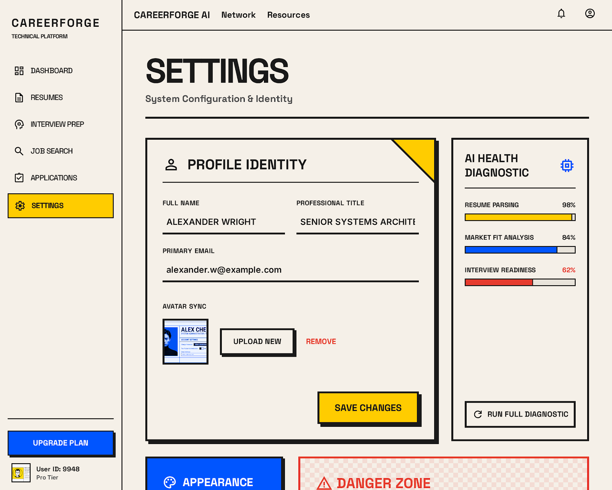

# CareerForge AI

[](https://nextjs.org/)
[](https://expressjs.com/)
[](https://www.mongodb.com/)
[](https://redis.io/)
[](https://openrouter.ai/)
[](https://ai.google/)
[](https://cloudinary.com/)
[](https://vercel.com/)
[](https://render.com/)

CareerForge AI is a full-stack AI-powered career readiness platform that helps candidates parse resumes, score ATS performance, tailor resumes for target roles, evaluate interview readiness, and manage job applications from one place.

It brings together resume intelligence, AI workflows, and productivity tools in a single, streamlined experience for job seekers.

## 1. Project Name

CareerForge AI

## 2. Problem Statement

Modern job seekers often use multiple disconnected tools to manage the hiring process:

- resume writing happens in one place,
- ATS analysis is done elsewhere,
- job applications are tracked manually,
- interview prep is separate,
- and role tailoring usually requires repetitive manual work.

This fragmentation makes the process slow, inconsistent, and difficult to optimize. CareerForge AI solves this by providing one unified system for resume parsing, ATS scoring, role-specific tailoring, mock interview prep, and application tracking.

## 3. Features

### Core Features

- Resume upload and parsing for PDF, DOCX, and TXT files
- Structured extraction of contact info, skills, work history, education, projects, and certifications
- ATS compatibility evaluation for formatting, structure, keyword alignment, and resume length
- Role-based resume tailoring with diff comparison and PDF export
- Gap analysis against job descriptions to highlight missing skills and recommendations
- Mock interview generation with role-specific questions and evaluation
- Interview history tracking and readiness insights
- Job search hub with curated deep links for external job boards
- Application tracking workflow with stage-based progress
- Real-time processing events using Socket.IO
- Authenticated flows using JWT
- Deterministic fallback engine when AI providers are unavailable

### Bonus Features

- Live agent timeline for processing pipeline visibility
- Resume version history and export management
- Search and application analytics dashboard
- Responsive Bauhaus neo-brutalist UI
- Production-ready Express backend with CORS and rate limiting

## 4. Technology Stack

### Frontend

- Next.js
- React
- Tailwind CSS
- Lucide React icons
- Socket.IO client
- Zustand state management

### Backend

- Node.js
- Express.js
- MongoDB with Mongoose
- Redis with BullMQ
- Socket.IO
- JWT auth
- Multer uploads

### AI and Cloud Services

- OpenRouter API
- Google Gemini API
- Cloudinary
- Deterministic offline fallback provider

### Dev and Infra Tools

- Vercel
- Render
- Axios
- Helmet
- Express Validator
- CORS
- Compression

## 5. Screenshots

### Landing Page


### Dashboard


### Resume Tailor


### Job Search Hub


### Interview Setup


### Interview Session


### Application Tracker


### Authentication Flow


### Settings View


## 6. Live Demo

### Frontend (Vercel)

https://careerforge-ai-three-eta.vercel.app

### Backend (Render)

https://careerforge-backend-mg0r.onrender.com

## 7. Backend

The backend API is deployed on Render and exposes the application logic for auth, resume processing, ATS analysis, tailoring, gap analysis, interview orchestration, and application tracking.

API health check:

https://careerforge-backend-mg0r.onrender.com/api/health

## 8. Setup Instructions

### Prerequisites

- Node.js 18+
- npm
- MongoDB Atlas account or local MongoDB instance
- Redis instance or use fallback mode
- Cloudinary account for production uploads
- OpenRouter and Gemini API keys if using AI providers

### 1. Clone the repository

```bash
git clone https://github.com/darekarbro/Agentic-AI-Automation.git
cd Agentic-AI-Automation
```

### 2. Install backend dependencies

```bash
cd server
npm install
```

### 3. Configure backend environment variables

Create a `.env` file inside the `server` folder with the required values.

### 4. Start the backend

```bash
npm run dev
```

The backend runs on:

- http://localhost:5000

### 5. Install frontend dependencies

```bash
cd ../client
npm install
```

### 6. Configure frontend environment variables

Create a `.env.local` file inside the `client` folder and add the required public variables.

### 7. Start the frontend

```bash
npm run dev
```

The frontend runs on:

- http://localhost:3000

### 8. Access the app

Open the following URL in the browser:

- http://localhost:3000

## 9. Environment Variables

Do not expose real secret values in GitHub or public repositories.

### Server (`server/.env`)

```env
PORT
NODE_ENV
CLIENT_URL
JWT_SECRET
MONGODB_URI
OPENROUTER_API_KEY
OPENROUTER_MODEL
GEMINI_API_KEY
GEMINI_MODEL
AI_PROVIDER_TIMEOUT_MS
CLOUDINARY_CLOUD_NAME
CLOUDINARY_API_KEY
CLOUDINARY_API_SECRET
REDIS_URL
```

### Client (`client/.env.local`)

```env
NEXT_PUBLIC_API_URL
NEXT_PUBLIC_SOCKET_URL
```

## 10. Deployment Notes

This project is designed for deployment on:

- Vercel for the Next.js frontend
- Render for the Express backend

The frontend and backend should use their deployed URLs in environment variables instead of localhost for production.

## Project Summary

CareerForge AI is built to help users modernize their career readiness workflow by combining resume intelligence, ATS scoring, personalized tailoring, interview preparation, and application tracking into a single powerful dashboard.

It is designed for candidates who want a more structured, AI-assisted, and efficient job search process.

## License

This project is intended for educational and portfolio use unless otherwise stated by the repository owner.